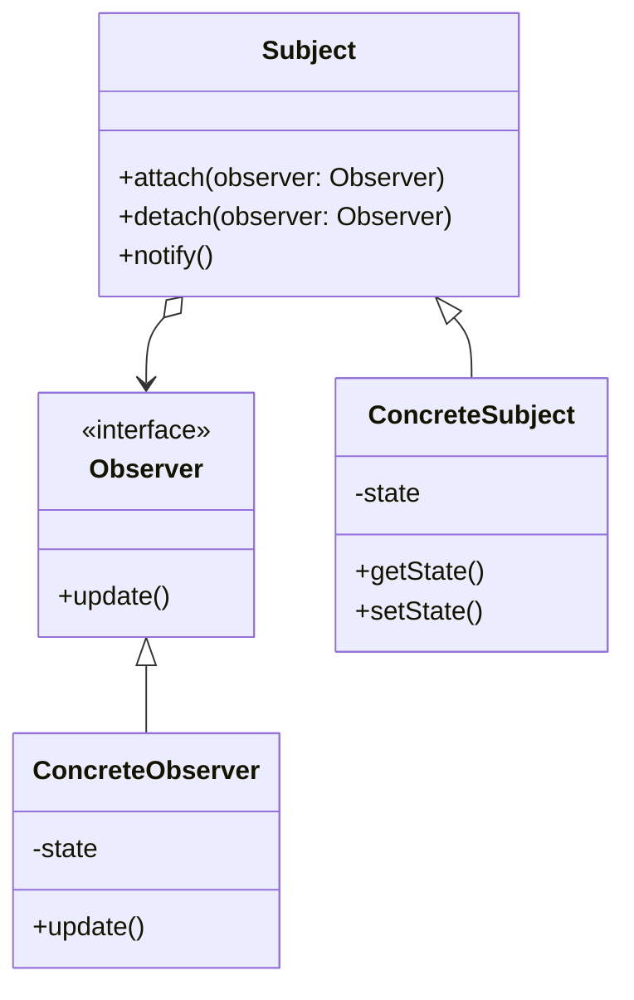

# 观察者模式 (Observer Pattern)

## 目录
- [简介](#简介)
- [模式结构](#模式结构)
- [基础实现](#基础实现)
- [示例代码](#示例代码)
- [最佳实践](#最佳实践)
- [进阶主题](#进阶主题)
- [常见问题](#常见问题)
- [相关模式](#相关模式)

## 简介
观察者模式是一种行为型设计模式，它定义了对象之间的一对多依赖关系。当一个对象（称为主题）的状态发生改变时，所有依赖于它的对象（称为观察者）都会得到通知并自动更新。

### 使用场景
1. 当一个对象的改变需要同时改变其他对象时
2. 当一个对象必须通知其他对象，而又不知道这些对象是谁时
3. 当一个抽象模型有两个方面，其中一个方面依赖于另一个方面时

### 优点
1. **松耦合设计**
   - 主题和观察者之间是松耦合的关系
   - 主题只知道观察者实现了某个接口

2. **支持广播通信**
   - 主题可以向所有观察者发送通知
   - 无需指定特定的接收者

3. **易于扩展**
   - 可以方便地添加新的观察者
   - 不需要修改原有代码

### 缺点
1. **可能引起性能问题**
   - 如果观察者数量太多，通知所有观察者会花费较多时间
   - 通知是串行的，可能会影响系统性能

2. **可能引起循环引用**
   - 如果观察者和主题之间存在循环依赖，可能导致系统崩溃

3. **通知顺序不确定**
   - 观察者被通知的顺序是不确定的
   - 不应该依赖通知顺序

## 模式结构

### UML类图


### 核心角色
1. **主题（Subject）**
   - 维护一组观察者对象
   - 提供添加和删除观察者的接口
   - 当状态发生变化时通知所有观察者

2. **观察者（Observer）**
   - 定义一个更新接口，用于接收主题的通知
   - 实现具体的更新逻辑

3. **具体主题（Concrete Subject）**
   - 继承自主题
   - 维护状态，并在状态变化时通知观察者

4. **具体观察者（Concrete Observer）**
   - 实现观察者接口
   - 定义具体的业务逻辑

## 基础实现

### 代码模板
```python
from abc import ABC, abstractmethod
from typing import List

# 观察者接口
class Observer(ABC):
    @abstractmethod
    def update(self, data: any) -> None:
        pass

# 主题基类
class Subject:
    def __init__(self):
        self._observers: List[Observer] = []
        self._state = None

    def attach(self, observer: Observer) -> None:
        if observer not in self._observers:
            self._observers.append(observer)

    def detach(self, observer: Observer) -> None:
        self._observers.remove(observer)

    def notify(self) -> None:
        for observer in self._observers:
            observer.update(self._state)

# 具体主题
class ConcreteSubject(Subject):
    def set_state(self, state: any) -> None:
        self._state = state
        self.notify()

# 具体观察者
class ConcreteObserver(Observer):
    def update(self, data: any) -> None:
        print(f"收到更新：{data}")
```

### 实现步骤
1. **定义观察者接口**
   - 创建抽象观察者类
   - 定义更新方法（update）

2. **创建主题类**
   - 实现观察者的注册（attach）
   - 实现观察者的移除（detach）
   - 实现通知方法（notify）

3. **实现具体主题**
   - 继承主题类
   - 实现状态管理
   - 在状态变化时通知观察者

4. **实现具体观察者**
   - 实现观察者接口
   - 定义具体的更新逻辑

## 示例代码

### 示例1：天气站监控系统（★ 入门级）
这是一个基础的观察者模式实现，模拟天气站和显示器的关系：
- 主题：天气站（WeatherStation）
- 观察者：温度显示器（TemperatureDisplay）和温度警报器（TemperatureAlert）
- 功能：当天气站温度发生变化时，自动通知显示器更新显示，并在温度过高时触发警报

### 示例2：电商库存监控系统（★★ 进阶级）
这个示例展示了一个更复杂的场景，模拟电商平台的商品库存系统：
- 主题：库存系统（StockSubject）
- 观察者：
  - 客户端应用（CustomerApp）
  - 库存系统（InventorySystem）
  - 价格分析系统（PriceAnalytics）
- 特点：
  - 支持多商品监控
  - 实现了多种类型的观察者
  - 包含业务逻辑判断和自动化建议

### 示例3：智能家居系统（★★★ 高级）
这是一个复杂的示例，展示了观察者模式在实际项目中的应用：
- 核心功能：
  - 多设备管理
  - 事件分类处理
  - 自动化控制
  - 安全监控
  - 能源管理
- 主要组件：
  - 智能家居中枢（SmartHomeHub）
  - 多种智能设备（SmartDevice）
  - 移动应用（MobileApp）
  - 自动化控制器（AutomationController）
  - 安防系统（SecuritySystem）
  - 能源监控（EnergyMonitor）

## 最佳实践

### 设计原则
1. **避免过多的观察者**
   - 控制观察者数量
   - 考虑使用观察者池

2. **考虑线程安全**
   - 在多线程环境下需要同步
   - 注意观察者列表的并发访问

3. **合理设计通知机制**
   - 可以考虑异步通知
   - 实现通知优先级

4. **防止内存泄漏**
   - 注意及时移除不需要的观察者
   - 使用弱引用存储观察者

### 实际应用场景
1. **GUI系统**
   - 按钮点击事件处理
   - 视图更新机制

2. **消息中间件**
   - 消息队列系统
   - 发布订阅系统

3. **系统监控**
   - 日志监控
   - 性能监控

4. **数据同步**
   - 数据库复制
   - 缓存同步

## 进阶主题

### 变体和扩展
1. **推模型 vs 拉模型**
   - 推模型：主题主动将所有数据推送给观察者
   - 拉模型：观察者主动从主题获取所需数据

2. **事件总线**
   - 使用事件总线统一管理订阅和发布
   - 支持更灵活的事件分发

3. **异步观察者**
   - 使用异步方式通知观察者
   - 提高系统响应性能

## 常见问题

### 实现难点及解决方案
1. **观察者顺序问题**
   - 问题：观察者通知顺序不确定
   - 解决：实现优先级机制或使用有序容器

2. **线程安全问题**
   - 问题：并发访问观察者列表
   - 解决：使用线程安全的集合或同步机制

3. **内存泄漏问题**
   - 问题：观察者未及时移除
   - 解决：使用弱引用或显式取消订阅

4. **性能问题**
   - 问题：大量观察者导致性能下降
   - 解决：使用观察者池或异步通知

## 相关模式
- **中介者模式**：观察者模式用于一对多的通信，而中介者模式用于多对多的通信
- **策略模式**：可以结合使用，让观察者根据不同策略处理通知
- **命令模式**：可以将命令封装成观察者
- **状态模式**：可以根据状态改变通知观察者
